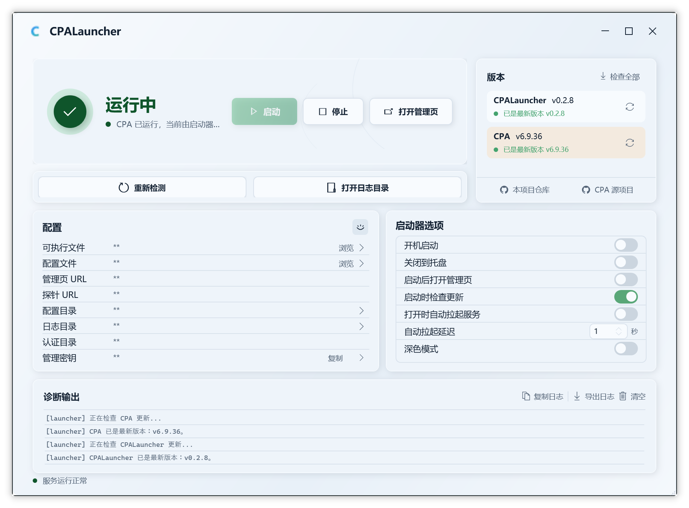

# CPA Launcher

原生 Windows 桌面启动器，用于管理 [CLIProxyAPI (CPA)](https://github.com/router-for-me/CLIProxyAPI) 的本地运行生命周期。

> 首次运行自动下载 CPA 并弹出配置向导，之后只需点击按钮即可启动、停止、最小化到托盘并打开管理页。



## 快速开始

1. 从 [Releases](https://github.com/elenaaasky/CPALauncher/releases) 下载 `CPALauncher-win-x64-self-contained.zip`
2. 解压到任意目录，运行 `CPALauncher.exe`
3. 首次启动会自动下载最新版 CPA 到程序同级 `cpa/` 目录
4. 在配置向导中填写监听地址、端口等参数（默认值通常可以直接用）
5. 点击「启动 CPA」即可

无需安装 .NET 运行时，解压即用。

## 定位

CPA Launcher **不是** CPA 的替代品、Web 管理页的替代品或配置编辑器。
它的职责只有一个：**让 CPA 在本地像一个普通桌面应用一样运行**。

## 功能

**核心**

- 首次运行自动下载 CPA 并弹出配置向导，开箱即用
- 一键启动 / 停止 CPA 进程
- 系统托盘常驻（双击恢复、右键菜单操作）
- 实时状态监控（运行中 / 启动中 / 已停止 / 外部运行）
- 自动检查 CPA 更新并一键升级
- 诊断输出面板（复制、导出、清空）

**配置管理**

- 选择 `cli-proxy-api.exe` 和 `config.yaml` 路径
- 自动推导管理页 URL、探针 URL、配置 / 日志 / 鉴权目录
- 设置持久化到 `%AppData%\CPALauncher\settings.json`

**自动化选项**

- 启动器打开时自动拉起服务（可设延迟）
- Windows 登录时自动启动启动器
- 服务就绪后自动打开管理页
- 关闭窗口时最小化到托盘

**外观**

- 深色 / 浅色主题切换

## 技术栈

| 项目 | 选型 |
|------|------|
| 平台 | Windows |
| 框架 | .NET 8 + WPF |
| UI 库 | [HandyControl](https://github.com/HandyOrg/HandyControl) |
| 托盘 | [Hardcodet.NotifyIcon.Wpf](https://github.com/hardcodet/wpf-notifyicon) |
| 架构 | MVVM |

## 从源码构建

```powershell
# 克隆仓库
git clone https://github.com/elenaaasky/CPALauncher.git
cd CPALauncher

# 构建
dotnet build src/CPALauncher.Wpf

# 发布单文件 exe
powershell -ExecutionPolicy Bypass -File .\scripts\publish-win-x64.ps1
```

产物为 `win-x64` 自包含单文件 exe，输出到 `artifacts\release\` 目录。

## 项目结构

```text
CPALauncher/
├─ scripts/                  # 发布脚本
├─ src/
│  └─ CPALauncher.Wpf/       # WPF 主项目
│     ├─ Models/              # 数据模型
│     ├─ Services/            # 进程管理、配置检查、自动更新等服务
│     ├─ ViewModels/          # MVVM ViewModel
│     └─ Views/               # XAML 视图
└─ README.md
```

## 许可证

[MIT](LICENSE)
